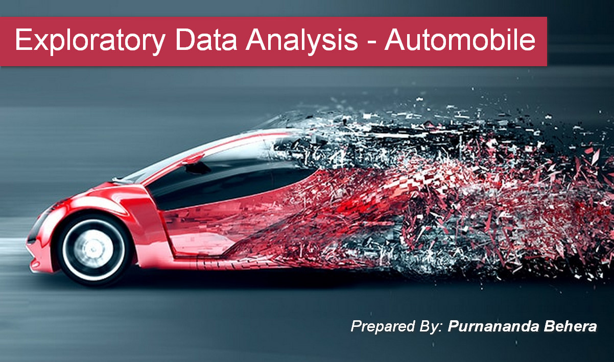

# Exploratory Data Analysis - Automobile

  

## About the Dataset:

This automobile dataset consist of data From 1985 Ward's Automotive Yearbook. Here are the sources:

<ul>
    <li>1985 Model Import Car and Truck Specifications, 1985 Ward's Automotive Yearbook.</li>
    <li>Personal Auto Manuals, Insurance Services Office, 160 Water Street, New York, NY 10038.</li>
    <li>Insurance Collision Report, Insurance Institute for Highway Safety, Watergate 600, Washington, DC 20037.</li>
</ul>

This data set consists of three types of entities: 

<ol>
    <li>the specification of an auto in terms of various characteristics,</li>
    <li>its assigned insurance risk rating,</li>
    <li>its normalized losses in use as compared to other cars.</li>
</ol>

## EDA Objective:

This study focus to find some meaningfull insight from Automobile dataset. Here are some problem statements below:

<ol>
    <li>Do the Body Size, Style and Engine Specification determine the car price?</li>
    <li>Which type of cars are better in terms of mileage?</li>
    <li>Which are highest selling cars based on brand, body style and price slab?</li>
	<li>Which are highest normalized loss reported cars based on body style and no of doors?</li>
	<li>Does body size influence symbolling?</li>
</ol>

## Help URL:
1. Dataset source: https://archive.ics.uci.edu/ml/datasets/automobile
2. Different types of engine: https://www.mechanicalbooster.com/2016/08/different-types-of-engine.html