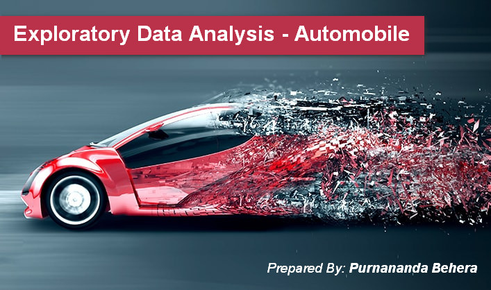

# Automobile - Exploratory Data Analysis

This project is coded through python, pandas, seaborn, matplotlib, etc.
  

## Help URL:
1. https://www.kaggle.com/toramky/eda-for-automobile-dataset
2. https://www.kaggle.com/rkamath1/exploratory-analysis-tests-regression/notebook
3. Dataset source: https://archive.ics.uci.edu/ml/datasets/automobile
4. Github Source: https://github.com/justinpolackal/eda-automobiles
5. Different types of engine: https://www.mechanicalbooster.com/2016/08/different-types-of-engine.html
